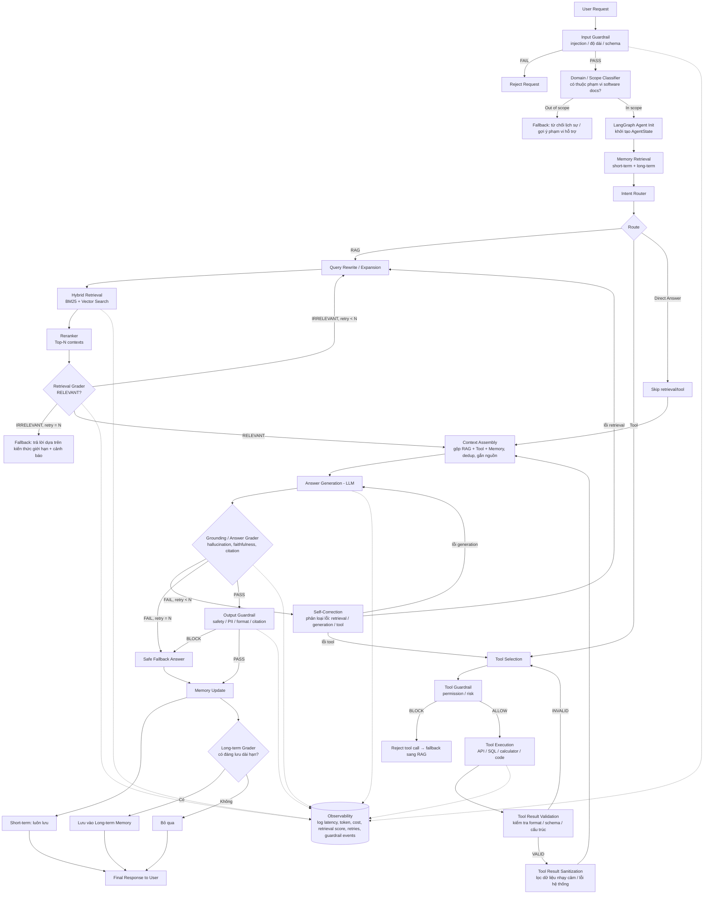

# software-agentic-rag
Self-Correcting Agentic RAG Platform for Software Engineering.

```mermaid
flowchart TD
    A[User Request] --> B[Input Guardrail<br/>injection / độ dài / schema]
    B -->|FAIL| B1[Reject Request]
    B -->|PASS| C[Domain / Scope Classifier<br/>có thuộc phạm vi software docs?]
    C -->|Out of scope| C1[Fallback: từ chối lịch sự / gợi ý phạm vi hỗ trợ]
    C -->|In scope| D[LangGraph Agent Init<br/>khởi tạo AgentState]

    D --> E[Memory Retrieval<br/>short-term + long-term]
    E --> F[Intent Router]

    F --> G{Route}
    G -->|RAG| H1[Query Rewrite / Expansion]
    G -->|Tool| H2[Tool Selection]
    G -->|Direct Answer| H3[Skip retrieval/tool]

    %% RAG branch
    H1 --> R1[Hybrid Retrieval<br/>BM25 + Vector Search]
    R1 --> R2[Reranker<br/>Top-N contexts]
    R2 --> R3{Retrieval Grader<br/>RELEVANT?}
    R3 -->|IRRELEVANT, retry < N| H1
    R3 -->|IRRELEVANT, retry = N| R4[Fallback: trả lời dựa trên kiến thức giới hạn + cảnh báo]
    R3 -->|RELEVANT| CTX

    %% Tool branch
    H2 --> T1[Tool Guardrail<br/>permission / risk]
    T1 -->|BLOCK| T1B[Reject tool call → fallback sang RAG]
    T1 -->|ALLOW| T2[Tool Execution<br/>API / SQL / calculator / code]
    T2 --> T3[Tool Result Validation<br/>kiểm tra format / schema / cấu trúc]
    T3 --> |INVALID| H2
    T3 --> |VALID| T4[Tool Result Sanitization<br/>lọc dữ liệu nhạy cảm / lỗi hệ thống]
    T4 --> CTX

    H3 --> CTX

    CTX[Context Assembly<br/>gộp RAG + Tool + Memory, dedup, gắn nguồn]
    CTX --> GEN[Answer Generation - LLM]

    GEN --> GR{Grounding / Answer Grader<br/>hallucination, faithfulness, citation}
    GR -->|FAIL, retry < N| SC[Self-Correction<br/>phân loại lỗi: retrieval / generation / tool]
    SC -->|lỗi retrieval| H1
    SC -->|lỗi tool| H2
    SC -->|lỗi generation| GEN
    GR -->|FAIL, retry = N| SAFE[Safe Fallback Answer]
    GR -->|PASS| OUT[Output Guardrail<br/>safety / PII / format / citation]

    OUT -->|BLOCK| SAFE
    OUT -->|PASS| MEM[Memory Update]
    SAFE --> MEM

    MEM --> MEM_S[Short-term: luôn lưu]
    MEM --> MEM_L{Long-term Grader<br/>có đáng lưu dài hạn?}
    MEM_L -->|Có| MEM_L1[Lưu vào Long-term Memory]
    MEM_L -->|Không| MEM_L2[Bỏ qua]

    MEM_S --> RESP[Final Response to User]
    MEM_L1 --> RESP
    MEM_L2 --> RESP

    OBS[(Observability<br/>log latency, token, cost, retrieval score, retries, guardrail events)]
    B -.-> OBS
    R1 -.-> OBS
    R3 -.-> OBS
    T2 -.-> OBS
    GEN -.-> OBS
    GR -.-> OBS
    OUT -.-> OBS
```