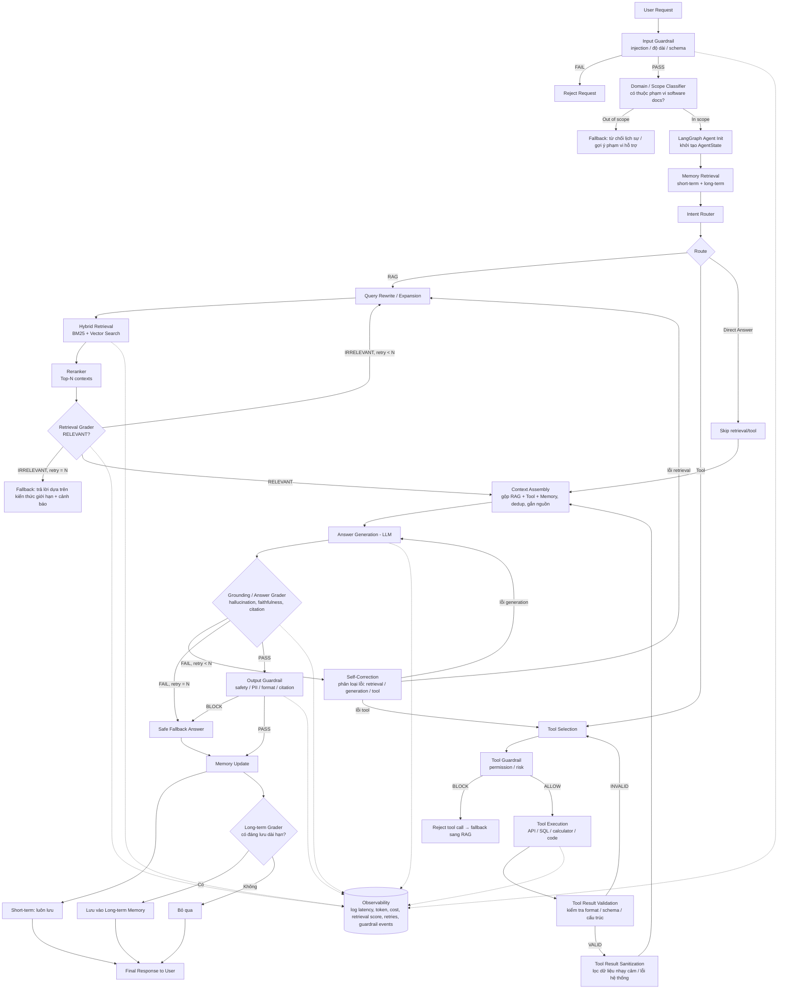

# Agentic RAG System — Luồng Hệ Thống (Revised)

## 1. Tổng quan

Hệ thống Agentic RAG cho phép người dùng đặt câu hỏi liên quan đến tài liệu kỹ thuật phần mềm (Python, FastAPI, LangChain, LangGraph, Docker, Kubernetes, PostgreSQL, Redis, GitHub). Kiến trúc dựa trên LangGraph, kết hợp Hybrid Retrieval (BM25 + Vector), Reranker, Grading/Self-Correction loop, Tool-calling có kiểm soát, và Guardrail ở cả đầu vào lẫn đầu ra.

So với bản gốc, bản revised bổ sung:
- **Domain/Scope Classifier** tách riêng khỏi Input Guardrail
- **Context Assembly** như một node riêng biệt trước Generation
- **Tool Result Sanitization** sau khi thực thi tool
- **Observability** là cross-cutting concern (sidecar) thay vì node tuần tự cuối
- **Phân loại lỗi trong Self-Correction** (retrieval / generation / tool) để route đúng nhánh retry
- **Memory Update** tách short-term (luôn lưu) và long-term (có grader lọc)

---

## 2. Sơ đồ Mermaid

---

## 3. Bảng thiết kế luồng hệ thống (Revised)

| # | Thành phần | Input | Xử lý chính | Output | Nếu thất bại |
|---|---|---|---|---|---|
| 1 | User Request | Câu hỏi người dùng | Nhận query | User query | — |
| 2 | Input Guardrail | User query | Prompt injection, độ dài, schema | PASS/FAIL | FAIL → Reject |
| 3 | Domain/Scope Classifier | Query hợp lệ | Xác định query có thuộc phạm vi software docs | IN-SCOPE/OUT | OUT → Fallback lịch sự |
| 4 | LangGraph Agent Init | Query in-scope | Khởi tạo AgentState | Agent state | Retry/error handling |
| 5 | Memory Retrieval | Query + session | Lấy short-term + long-term memory | Relevant memories | Tiếp tục nếu rỗng |
| 6 | Intent Router | Agent state | Xác định RAG/Tool/Memory/Direct | Route | Fallback route |
| 7 | Query Rewrite/Expansion | Original query | Tăng khả năng retrieval | Optimized query | Dùng query gốc |
| 8 | Hybrid Retrieval | Optimized query | BM25 + Vector Search | Top-K documents | → Retrieval Grader fail path |
| 9 | Reranker | Top-K documents | Sắp xếp theo relevance | Top-N contexts | Giảm N / retrieve lại |
| 10 | Retrieval Grader | Query + contexts | Đánh giá đủ liên quan | RELEVANT/IRRELEVANT | IRRELEVANT → Rewrite (tối đa N lần) → Fallback |
| 11 | Tool Selection | Query + Agent state | Quyết định gọi tool nào | Selected tool | Fallback sang RAG |
| 12 | Tool Guardrail | Tool call | Permission, risk, param check | ALLOW/BLOCK | BLOCK → fallback sang RAG |
| 13 | Tool Execution | Tool + params | Gọi API/SQL/calculator/code | Tool result | Retry/fallback |
| 14 | Tool Result Validation | Tool result | Kiểm tra dữ liệu đúng format / schema / cấu trúc chưa | VALID/INVALID | INVALID → Reject tool call → fallback sang Tool Selection |
| 15 | Tool Result Sanitization | Tool result | Lọc dữ liệu nhạy cảm, lỗi hệ thống lộ ra | Clean tool result | Loại bỏ phần không an toàn |
| 16 | Context Assembly | RAG context + Tool result + Memory | Gộp, dedup, gắn nguồn, cắt theo token budget | Assembled context | — |
| 17 | Answer Generation | Assembled context | LLM tạo câu trả lời | Draft answer | Regenerate |
| 18 | Grounding/Answer Grader | Draft answer + evidence | Hallucination, faithfulness, citation check | PASS/FAIL | FAIL → Self-Correction |
| 19 | Self-Correction | Failed answer/retrieval/tool | Phân loại lỗi → route lại đúng node | Improved answer | Retry tối đa N lần → Safe Fallback |
| 20 | Output Guardrail | Final answer | Safety, PII, policy, format, citation | PASS/BLOCK | BLOCK → Safe Fallback / sanitize |
| 21 | Memory Update (short-term) | Conversation | Lưu luôn vào short-term | Updated short-term | — |
| 22 | Memory Update (long-term) | Conversation + result | Grader đánh giá có đáng lưu dài hạn | Updated long-term hoặc bỏ qua | Không lưu nếu không cần |
| 23 | Observability (cross-cutting) | Toàn bộ pipeline | Log latency, token, cost, retrieval score, retries, guardrail events tại **mọi** node | Trace/metrics | — |
| 24 | Response | Validated answer | Trả kết quả cho user | Final response | Safe fallback |

---

## 4. Nguồn dữ liệu đề xuất (Documentation Corpus)

Các nguồn dưới đây phù hợp để crawl cho corpus RAG (đều là tài liệu kỹ thuật công khai, có cấu trúc rõ ràng — thuận lợi cho chunking theo heading):

- Python official documentation
- FastAPI documentation
- LangChain documentation
- LangGraph documentation
- Docker documentation
- Kubernetes documentation
- PostgreSQL documentation
- Redis documentation
- GitHub documentation (~300 bài)

**Lưu ý khi crawl:**
- Tôn trọng `robots.txt` và rate limit của từng site (đặc biệt K8s/Docker docs có thể chặn crawler mạnh tay).
- Giữ metadata: URL nguồn, version của docs (vd Python 3.12 vs 3.13), ngày crawl — để phục vụ citation và tránh trả lời dựa trên version cũ.
- Một số docs (LangChain/LangGraph) đổi cấu trúc API khá thường xuyên → nên có pipeline re-crawl định kỳ, không chỉ crawl 1 lần.
- Với GitHub docs, giới hạn 300 bài là hợp lý để tránh nhiễu (GitHub docs có rất nhiều trang trùng lặp nội dung theo enterprise/cloud/free-tier).
